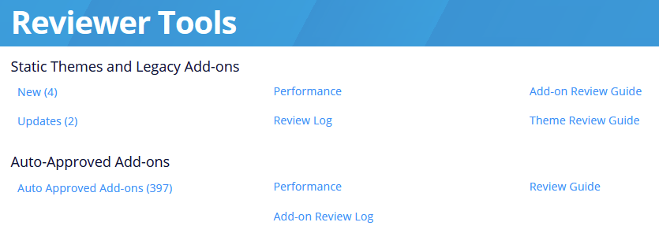
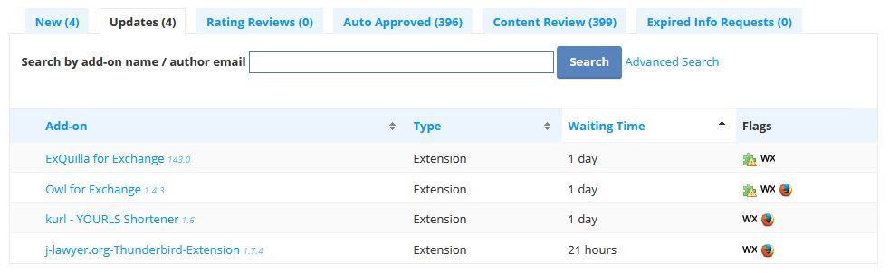
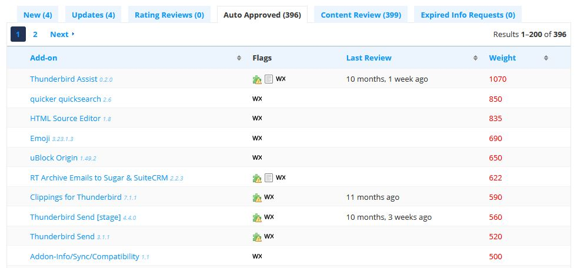

# Introduction

## Reviewer Tools on ATN 

The [reviewer tools](https://addons.thunderbird.net/reviewers/) available on addons.thunderbird.net (ATN) are the central utilities for managing add-on reviews. Key features include:

* **Overview Page:** Lists add-ons waiting for review, organized into multiple queues—for example, separate queues for new add-ons and for add-on updates.
* **Validation Report:** Displays the results of the pre-analysis for each add-on, providing helpful context during the review process.
* **File Viewer:** Diff between different add-on versions. Validation results are shown inline within the viewer for easier reference.

Most of the reviewer tools pages are fairly straightforward, but we have prepared a video that will give you an introduction to the tools. We recommend taking a moment to watch it now.

### Overview page

After logging in to the [reviewer tools](https://addons.thunderbird.net/reviewers/), you will see an index page:\

<figure><figcaption></figcaption></figure>

The links in the left column will open the [queue pages](https://addons.thunderbird.net/en-US/reviewers/queue/) explained in the next section. “Performance” links will show some reviewer statistics, and the “Review Log” links will list information about recent add-on reviews.

### Queue page 

The [queue page](https://addons.thunderbird.net/en-US/reviewers/queue/) is the main entry point for performing add-on reviews. Here you will find a table of different review queues:

<figure><figcaption></figcaption></figure>

* **Rating Reviews:** Reviews (as in “product review”) by registered ATN users, which have been flagged as inappropriate. See the [Moderation Review Guide](moderation-review-guide.md) for more information.
* **New and Updated Add-ons:** Must be manually reviewed according to the [Add-on Review Guide](add-on-review-guide.md).
* **Auto-Approved Add-ons:** WebExtensions that do not access sensitive information (e.g., messages or contacts) and are automatically approved.

The review queue for auto-approved add-ons is sorted according to weight, otherwise known as risk. The highest weighted add-ons are sorted at the top of the list. A number of factors are included in the risk calculation, including abuse reports, therefore add-ons that turn out to be malicious will quickly bubble up in the list.

It is good practice to regularly perform manual reviews of auto-approved add-ons, focusing on those with the highest calculated risk.

<figure><figcaption></figcaption></figure>

## Setting up a Review Environment 

As a reviewer, you have access to systems that allow approving and rejecting large amounts of add-ons. Add-ons that have not been reviewed may contain code that aims to control your computer, steal personal information or send messages on your behalf, impersonating you as a reviewer.

As such, you need to be conscious and security-aware when accessing and using the reviewer tools. Please adhere to the following security guidelines:

* Use a separate Thunderbird profile for testing add-ons, which you can regularly throw away and recreate.
* When testing add-ons that require additional software (e.g. through native messaging), always make use of a VM to facilitate testing. You can use for example Microsoft Hyper-V (Windows Pro), [QEMU](https://www.qemu.org/) or[ VirtualBox](https://www.virtualbox.org/). Make use of snapshots to reset the VM after installing third party software.
* Never log in to the reviewer tools from within the VM where you install third party software related to add-ons.

If you become aware of a potential leak or misuse of your ATN credentials, please get in touch with the [admin team](mailto:atn-admins@thunderbird.net) immediately so we can analyze and ensure your account was not accessed by a malicious third party.

## Communication Channels

All reviewers are subscribed to the [add-on reviewer matrix channel](https://matrix.to/#/#tb-addon-reviewers:mozilla.org?web-instance\[element.io]=chat.mozilla.org). On this channel, users can contact reviewers if they have questions about reviews.

Additionally, reviewers are subscribed to a [closed topicbox group](https://thunderbird.topicbox.com/groups/addon-reviewers), to discuss add-on reviews and review policies. If you have questions about a review, you can ask them there.

Reviewers should also subscribe to the [add-on developer channel](https://thunderbird.topicbox.com/groups/addons), since developers may use it to report issues encountered during review or submission.

## Conduct and Accountability

This section outlines the expectations for reviewer behavior and the standards used to ensure accountability, helping maintain a fair, professional, and safe review process.

### Behavior

We put a great deal of trust in our review team, so we expect reviewers to handle themselves ethically and professionally. They shouldn't abuse their power, for personal gain or any other reason. The following list is not comprehensive, but should give you an idea of what the expectations are:

* You must never review or moderate user reviews for add-ons you have contributed code to, or add-ons that directly compete with yours.
  * If you have contributed code to an ATN add-on, your reviewer account should be linked to that add-on, either as an owner or a developer. If you don't wish to be publicly visible as a contributor, ATN allows it to be hidden.
  * If it's not possible to do this for whatever reason, your contributions should be disclosed to the Thunderbird Add-ons Team.
* When performing reviews and communicating with add-on developers, please maintain a professional and courteous tone at all times. If a developer is being stubborn, offensive or otherwise uncooperative, don't reply, and escalate the case to an admin.
* The review tools must be used exclusively for performing add-on reviews. Any other unsolicited requests or questions to add-on developers are not allowed. You can use public contact information to approach developers as any regular user, but you should also disclose if you learned about the add-on while looking at it through the review tools.
* You are encouraged to review add-ons you have looked at before. Having knowledge of the code is beneficial and saves time. However, you should refrain from exclusively dedicating your time to a small amount of add-ons, or reviewing too many versions of the same add-on consecutively (more than 4). Make sure to take turns with other reviewers on a regular basis.
* Sometimes, add-on developers will offer to show their appreciation for your time and assistance by offering a gift, such as a promotional t-shirt. Small gifts are allowed, but we require them to be disclosed to the Thunderbird Add-ons Team.

Admins monitor the reviewer group regularly and remove reviewers who have been inactive for extended periods of time. While we appreciate all contributions, it's best that reviewers have regular activity so they are less likely to overlook things. Also, access to add-on code and our internal mailing list are privileges that should be limited to active contributors.

### Enforcement

Reviewers represent Thunderbird in their decisions and interactions with add-on developers, so establishing and enforcing review standards is essential to a good developer experience and user safety.

Admin reviewers perform regular spot checks of reviews. During these checks, they might find mistakes in review decisions. Here are the types of mistakes we track and their corresponding severity:

* **Most severe:** These errors lead to a terrible developer experience, or security issues for users:
  * Approving an add-on that should have been rejected
* **Severe:** These errors are not egregious but can lead to a bad developer experience if numerous:
  * Rejecting an add-on when it should have been approved
  * Rudeness or offensive language when addressing a developer
* **Minor:** These errors are minor, but again not great if numerous:
  * Incoherent English
  * Unresponsive or not helpful when involved in conversation with developer

If multiple severe and/or frequent mistakes are found, reviewers will receive a notification that they have been put on probation. In probation, an admin will spot-check a reviewer’s activity for six months and remove them from the group if they make one more severe mistake. If the reviewer improves, they will remain in the group conditionally, provided they do not revert to making errors.

Removal of reviewing rights is rare and done only when we feel users may experience a security risk, developers are having a poor experience, or the contributions are causing a drain on resources. If you have any questions or concerns, please contact us in one of the ways listed above.

Thanks for joining the team and supporting the add-on community, our developers and users appreciate your contributions!
