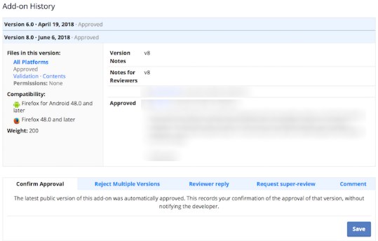
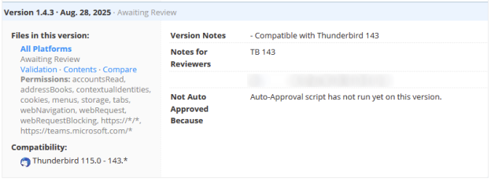

# Add-on Review Guide

## Guidelines & Resources 

Add-on reviewers help ensure add-ons are safe to use, reliable and clearly presented to users. You should provide quick, clear, and actionable feedback to developers if issues are found with their add-ons. The following guidelines and resources will help you perform reviews consistently and in line with official policies.

* **Review Policies:** Familiarize yourself with the Review Policies at[ https://thunderbird.github.io/atn-review-policy/](https://thunderbird.github.io/atn-review-policy/). All decisions should be based on these policies. Please make sure you have read and understood them.
* **Source Code Submission:** Reviewers must understand the Source Code Submission Guidelines at [https://extensionworkshop.com/documentation/publish/source-code-submission/](https://extensionworkshop.com/documentation/publish/source-code-submission/), as they describe how add-on code should be structured and submitted for review.
* **Third-Party Library Usage:** Understand the Third-Party Library Usage Guidelines at[ https://extensionworkshop.com/documentation/publish/third-party-library-usage/](https://extensionworkshop.com/documentation/publish/third-party-library-usage/).\
  \
  &#xNAN;_<mark style="color:$warning;">Note: We</mark> <mark style="color:$warning;"></mark><mark style="color:$warning;">**do**</mark> <mark style="color:$warning;"></mark><mark style="color:$warning;">accept references to the</mark> <mark style="color:$success;">`jsdelivr`</mark> <mark style="color:$warning;">and</mark> <mark style="color:$success;">`unpkg`</mark> <mark style="color:$warning;">CDNs. Links must point to an exact version, e.g.,</mark>_
  * _https://cdn.jsdelivr.net/npm/jquery@3.6.4/src/core.min.js_
  * _https://unpkg.com/react@18.3.1/umd/react.production.min.js_
* **Canned Responses:** Use canned responses whenever possible. Reviewing the list of available responses can help identify potential issues and maintain consistent messaging to developers.
* **Balancing Enforcement and Appreciation:** Strive for a balance between enforcing rules and acknowledging a developer's commitment. If an add-on was initially rejected and a follow-up submission addresses most review requests, consider sending the "Required Changes Next Release" canned response as a reviewer reply, listing the remaining items, and then accepting the add-on. However, if the next submission fails to address these items, it must be rejected.
* **Accept/Reject Messages:** Avoid including extra information in "accept" messages, as developers rarely read them. Reserve additional details for "reject" messages or "reviewer replies."
* **Reviews must be complete:** All issues should be clearly identified and documented, ensuring that the next submission can be approved once the developer addresses all listed items.\
  &#xNAN;_<mark style="color:$warning;">Exception: The first review step for some add-ons is to build them and verify that the uploaded XPI matches the generated one. If that step fails, reject directly with the Source archive mismatch canned response.</mark>_
* **Minification:** The submitted XPI file must be reviewable and not include minified or otherwise unreadable code. There are two exceptions:

1. The add-on uses well-known third-party libraries and includes links to the used files (e.g., in a <mark style="color:$success;">`README.md`</mark> or <mark style="color:$success;">`VENDORS.md`</mark> file). These files must be unchanged and match the referenced versions.
2. The add-on includes a source archive with readable code and a build process that generates the submitted XPI. In this case, the source archive is reviewed instead of the submitted XPI file. If the submitted XPI does not match the generated XPI, the submission must be rejected with the "Source archive mismatch" canned response.

* **Renamed Files:** During review, you may encounter renamed files. This is typically done to work around caching issues, especially in Themes and Experiment add-ons, and is not intended to make review more difficult.
* **Ask for help:** If you are unsure about a review, don’t hesitate to ask for feedback in the add-on reviewer Matrix channel ([https://developer.thunderbird.net/add-ons/community](https://developer.thunderbird.net/add-ons/community)). There are no dumb questions when it comes to the review policies!

## Review Process

Log in to [addons.thunderbird.net](http://addons.thunderbird.net), access the [reviewer tools](https://addons.thunderbird.net/reviewers/), open an add-on review queue and click on a listed add-on to start a review.

\
When looking at the review page, you will see information on the latest add-on version that was submitted. It may contain notes from the developer in the “Notes to Reviewers” section. There may also be past conversations between reviewers and developers that you should read.

<figure><figcaption></figcaption></figure>

Unless an add-on was just recently submitted, it will have past versions that will also contain notes. You do not need to read through each and every version’s notes, but it is helpful to read up on the notes from the last rejection or confirmed approval to ensure all issues are taken care of. Once you have obtained an overview of the review history, you can go on to review the add-on.

The add-on review process consists of the following phases:

* **ATN Content Review:** Add-ons are inspected to verify that the listing adheres to content review guidelines, including metadata such as the add-on name and description.
* **Technical Code Review:** The source code is inspected to ensure compliance with review policies.
* **Technical Content Review:** All files bundled with the add-on are checked to ensure they adhere to content review guidelines.
* **Basic Functionality Testing:** The add-on is tested to ensure it functions as described.

These phases will be discussed in more detail in the “Review Phases” section.

## Review Actions

* **Reviewer Reply:** If the extension complies with the review policy, but you have questions or suggestions, click “Reviewer Reply”. Use a canned response if possible to inform the add-on developer about potential issues. You can still continue and accept the review after having used “Reviewer Reply”, or wait for an answer and leave the extension in the queue.
* **Approve:** If the extension complies with the review policy outlined in this document and is ready to be accepted, click “Approve” and then “Save” to submit the accepting review.
* **Reject:** If the extension does not adhere to the guidelines, click “Reject”. Enter the rejection message in the box using appropriate canned responses, or clearly describe which parts are violating our policy. Finally, click “Save” to submit the rejecting review, send the prepared message to the developer and remove the extension from the review queue.
* **Request Super Review:** If you are not sure about whether something is acceptable or not, escalate it to admin review by clicking “Request Super Review” in the review tools and describe the issue in the text area. Don’t reject immediately.
* **Escalate:** There are certain cases that are severe enough that the reviewer actions on [addons.thunderbird.net](https://addons.thunderbird.net/en-US/thunderbird/) are not sufficient, and you must inform the admin team. This is especially true for reporting child pornography, add-ons containing abusive functionality or being of malicious nature that must be blocked. In such cases, you should contact the admin team via email at atn-admins \[at] thunderbird \[dot] net.

**Our general policy is to only reject when necessary.** If there are no security issues or severe functional issues, it is often possible to send a reviewer reply asking the author for the relevant changes for the next submission, and then accepting the current submission.

## Review Phases

### ATN Content Review

All public descriptions accessible through the add-ons listing page must comply with the[ Mozilla Acceptable Use Policy](https://www.mozilla.org/about/legal/acceptable-use/). Add-ons may be rejected during content review for the following reasons:

* Obscene or pornographic images in icons or screenshots.
* Hate speech in the add-on listing.
* Includes references to online gambling.
* The add-on is spam.

Additionally, the following items require review:

* **Private Use Add-ons:** Extensions that are intended for internal or private use, or for distribution testing, should not be listed on ATN and should be rejected. These add-ons can be[ self-distributed](https://extensionworkshop.com/documentation/publish/self-distribution/) instead. Add-ons are private if they require more than simply registering an account in order to be usable. Examples include needing a business contract, university admission, or club membership. The number of potential users does not affect this determination.
* **Add-on Listing Page:** The listing page should clearly explain the add-on's entry points and usage. Screenshots are strongly recommended, and when provided, they must be added using the dedicated ATN screenshot fields. **Please do not reject an extension only because you think the description and summary are not sufficient.** Instead, use the “Reviewer Reply” tool and select the “Incomplete Description” canned response to message the developer. You can customize the canned response as you see fit.
* **SEO/Spam Abuse:** Check for SEO/spam abuse. External links are prohibited within the add-on's description and the author's self-description. This is to prevent artificial boosting of search engine reputation by leveraging the trust of addons.thunderbird.net. Themes are often misused for this purpose due to their ease of creation.
* **Developer Links:** Developers may use the "Homepage link" or "Support link" to direct users to their own pages, provided these pages do not contain potentially hazardous content. These pages must be under the developer's control. Links to projects on common developer platforms (e.g., GitHub) are acceptable.
* **Name of the author:** If the name violates [Mozilla’s Acceptable Use Policy](https://www.mozilla.org/about/legal/acceptable-use/), please escalate to admin review.
* **Infringement of Mozilla and/or Thunderbird copyright or trademarks:** The usage of “Mozilla”, “Firefox” or “Thunderbird” are not allowed in the add-on name, except if they use the format _"\<Add-on name> for Thunderbird"_. Exceptions to this are extensions that are officially owned by the [Thunderbird Services](https://addons.thunderbird.net/en-US/thunderbird/user/thunderbird-services/) account.\
  \
  &#xNAN;_<mark style="color:$warning;">Note: Reviewers should not evaluate potential copyright or trademark infringements, except in the mentioned cases involving Mozilla trademarks. Because determining infringement is a complex legal matter, any concerns in this area should be escalated to admin review.</mark>_

### Technical Code Review

Add-ons that have not previously been reviewed by a human need to be inspected in their entirety. Once a manual review has been completed successfully, it is sufficient to review the changes since the last confirmed approval.

_<mark style="color:$warning;">Note: Be more strict on initial reviews. If a developer is already unwilling to follow review requests at this early stage, it will be much harder to request changes later. This serves not only as a technical safeguard, but also as a way to ensure developers are prepared to follow later review requirements.</mark>_

<figure><figcaption></figcaption></figure>

Always check the “Validation” link first and evaluate the reported warnings and errors.

_<mark style="color:$warning;">Note: Our linter currently does not know Thunderbird specific APIs and permissions and will report them as unknown. You have to manually check if the API is actually supported or not.</mark>_

If the review version contains a “Compare” link, you can use this to compare against the last confirmed version. Otherwise, use the “Content” link to view the add-on source code.

_<mark style="color:$warning;">Note: It is also possible to download the new submission and the last approved submission and use local tools for comparison. The download link is hidden behind “All Platforms”.</mark>_

#### Preparations for add-ons with an attached source archive

<figure><figcaption></figcaption></figure>

* For add-ons that include an additional source archive, the first review step is to build the XPI from the provided source (mostly via npm, yarn, or pnpm). If the user fails to provide clear build instructions or the generated XPI does not match the submitted XPI, the submission must be rejected with the "Source archive mismatch" canned response.
* The submitted source archive must be reviewed instead of the submitted XPI.

#### General code review guidelines 

The `manifest.json` is a good entry point, as it allows you to obtain an overview of the add-on’s functionality. You should review all the files in the add-on.&#x20;

When finding issues during a review, note them in the review comment field on the review page, preferably using canned responses.&#x20;

_<mark style="color:$warning;">Note: Your text is inserted into an email that handles all the formalities, you do not need to begin your review with “Dear Developer” or sign with your name.</mark>_

While the review comments field is free-form, we have a de-facto standard approach that lists the review issues in numbered lists, each with a headline. Here is an example review text to give you an idea:

> _This add-on didn't pass review because of the following problems:_
>
> _1) pages/inject.html:8 - We don't allow add-ons to use remote scripts because they can create serious security vulnerabilities. We also need to review all add-on code, and this makes it much more difficult. Please insert those scripts locally from your add-on code._\
>
>
> _In addition, the following information is required to complete the review:_
>
>
>
> _1) Please provide us with detailed information on how to test this add-on. If authentication to a website is necessary, give us a test username and password to facilitate our work. This can be provided in the Whiteboard field, which can be found in the Edit Listing page under the Technical Details section. This information is only available to reviewers._

It is very important to **include the file and line number of each issue** you find. This will help developers quickly identify and address issues. While the issue may seem obvious to you, it may not be readily apparent to the developer. Including line numbers quickly resolves this issue and reduces frustration on all sides.

If the same issue occurs more than a few times in each file, you should cite at least three lines where the issue occurs. If there are more than three occurrences of the same issue, you can let the developer know that similar issues exist in other parts of the file.

_<mark style="color:$warning;">Note: You can read more about how to best make use of the responses and find examples that will help you make better review decisions in our Review Decision Guidelines.</mark>_

Reviewers should specifically check the following items during code reviews:

* **Unused files:** Check for any files that are not used by the add-on and request removal.
* **Overly simple add-ons/themes:** Reject add-ons or themes that serve no meaningful purpose or benefit to the user. This includes test add-ons.
* **Spam:** Reject any submissions that are clearly intended to spam or flood the system.

#### WebExtension code review guidelines 

The permission system already limits what extensions can do, but there are still a few things that reviewers need to check during Extension code review:

* **Libraries and other Minified Code:** It is common for add-ons to use libraries or frameworks such as jQuery or React. Even though these libraries could potentially do more harm in WebExtensions than on regular web pages due to the elevated functionality provided by WebExtension APIs, we currently trust widely used libraries and do not review them individually. However, we require that these libraries are shipped with the add-on and are not modified.\
  \
  If you feel unsafe about a certain library, seek feedback from the reviewers team or perform a review of the library itself and make sure it complies to our policies. If you come across library methods that are potentially unsafe, find out if the method is actually used in the add-on.\
  \
  The developer must provide links to the library files they used in accordance with our [Third-Party Library Usage](https://extensionworkshop.com/documentation/publish/third-party-library-usage). If the link is missing or the linked file does not match the included file, reject the submission with the Missing Library reference canned response.\
  \
  Aside from libraries, many add-ons include minified, obfuscated or otherwise machine-generated code. Since this code can't be easily reviewed without the original sources, they have to be provided by the developer as a source archive. If that's not the case, reply to the developer with the Missing Source canned response. You can read more about our[ Source Code Submission guidelines](https://extensionworkshop.com/documentation/publish/source-code-submission).
* **fetch() and XMLHttpRequest:** Add-ons may not upload sensitive user data, such as messages or contacts, to a remote system without the user’s knowledge and consent.
  * **User-Configured Connections (e.g., URL in options page):** If the user is required to set up the connection themselves (e.g., by entering a URL in the options page), this is considered a deliberate act. However, the options page must briefly list the data being sent.
  * **Hardcoded Third-Party Servers (as a service):** If a third-party server is hardcoded, the add-on requires a privacy policy. This policy must be entered directly into the appropriate field on ATN and must not be linked. The add-on must also request the <mark style="color:$success;">`sensitiveDataUpload`</mark> permission in its manifest.
* **innerHTML:** Not permitted. Use the "innerHTML" canned response that provides alternatives and ensure all instances are listed.

_<mark style="color:$warning;">Note: We usually do not review third-party libraries and currently allow the use of</mark> <mark style="color:$success;">`innerHTML`</mark> <mark style="color:$warning;">within them. This may be revisited in the future.</mark>_

* **DOMParser():** If <mark style="color:$success;">`DOMParser()`</mark> is used to inject unsanitized content, it is as dangerous as using <mark style="color:$success;">`innerHTML`</mark>. Use the "DomParser" canned response.
* **Unused Permissions:** Extensions must not request permissions which they do not need. Common cases are:
  * <mark style="color:$success;">**`tabs`**</mark>**,&#x20;**<mark style="color:$success;">**`activeTab`**</mark>**:** While heavily used in Firefox for web page operations, these are often unnecessary for Thunderbird. They grant host permission to any or the active tab, allowing reading of its URL and injecting content scripts into the tab.
  * <mark style="color:$success;">**`tabhide`**</mark>**:** This permission is unsupported.
  * Most other permissions share the same name as their API, making usage checks straightforward. If unsure, contact the add-on reviewer channel.
* **Code Improvements:** If possible, conduct a code review to identify potential improvements or opportunities to utilize other API features ([https://webextension-api.thunderbird.net/](https://webextension-api.thunderbird.net/)).

#### Experiment code review guidelines 

Experiments have full access to the user’s system and can modify any aspect of Thunderbird’s UI. They need to be treated with great care and should be escalated to admin review.&#x20;

The following items need to be checked thoroughly:

* **Re-implementation of WebExtension APIs:** Extensions must use existing WebExtension APIs instead of custom Experiment implementations. This stands true even if the custom Experiment offers better performance, for example implementing a message search using Gloda, instead of <mark style="color:$success;">`browser.messages.query()`</mark>.
* **Custom UI Entry Points:** WebExtensions must use the standard entry points for options, menus, and other UI elements. Experiments must not divert from this behavior, for example by adding options inside Thunderbird’s own preferences or placing menu entries outside the default position at the bottom. Historically allowed custom entry points are:
  * additional toolbar button (alternative: menu-type action buttons)
  * modification of the message header pane (alternative: action button or message display scripts)
* **Impact on Stability:** Experiments must not compromise Thunderbird’s stability. They should be designed and implemented in a way that avoids crashes, performance degradation, or interference with core functionality. Any Experiment that poses a risk to Thunderbird’s stability should not be accepted.
* **Single Purpose:** Experiments must have a clear, dedicated purpose, with control logic remaining in the WebExtension. They should not be implemented as “blobs” that include all the control logic. Historically allowed “blob” Experiments are:
  * [WindowListener API](https://developer.thunderbird.net/add-ons/updating/historical-overview) (should be replaced by dedicated Experiments)
* **Maintenance Burden and User Satisfaction:** Experiments must be updated frequently to remain compatible with Thunderbird’s monthly release cycle. If they are not updated in time, users experience broken functionality and frustration. Because of this maintenance burden, it is often better to ship a slightly reduced feature set using only WebExtension APIs rather than relying on an Experiment. Reviewers should discuss this trade-off with developers, as they are often not aware of the consequences.

### Basic Functionality Testing

This step involves installing and testing the add-on. You are **not expected to extensively test every feature**; instead, spend no more than **10 minutes** reviewing the add-on’s functionality to determine if it behaves as described. Use this testing to answer the following questions:

* **Does the add-on act as described in the summary and description?**
* **Is the add-on generally functional?**\
  For example, if you click on its browser action or open its options page, do the pages load correctly? We do not reject add-ons for minor bugs or incomplete features, but if the add-on does not work at all, we want to protect users from a poor experience.
* **Does logging in using developer-provided credentials give access to the described functionality?**\
  Developers must provide testing credentials if their add-on relies on a service.\
  Use these credentials to log in and confirm that the advertised core functionality exists.
* **If data is sent to remote servers, is it clear which data is being sent?**
* **Are there any findings from the code review you want to verify?**\
  For example, if the code suggested that sensitive data might be sent, but you are unsure, you can use this step to trigger the relevant functionality and confirm whether sensitive data is transmitted.

If necessary, you can use the browser console, network monitor and other developer tools to help with functional testing.\

### Technical Content Review 

#### General content review guidelines

The content of add-ons must comply with the[ Mozilla Acceptable Use Policy](https://www.mozilla.org/about/legal/acceptable-use/). In general, add-ons may be rejected during content review for the following reasons:

* **Obscene, pornographic, or sexualized material:** Any obscene or pornographic material (photographic or non-photographic), including:
  * bondage/violence, bestiality, adult diaper wear, or other sexual fetish
  * bodily fluids (e.g. ejaculation or vomiting)
  * depictions of sex acts via camera angles, cropping, poses, or focus of images
  * nudity (bare breasts of women and/or genitals/bare buttocks of either gender), where the objective is not appreciation of the arts. Female nipples and/or genitalia of either gender visible through wet clothing. Images like Leonardo Da Vinci’s Vitruvian Man or Baroque cherubs are ok unless they are intentionally represented in a sexual context
  * manipulation of images to distort or disfigure body parts, with the intention to shock, e.g. grossly inflated breasts, male parts Photoshopped onto female bodies, naked breasts with nipples removed
* **Child pornography or suggestive material:**
  * Child pornography must be escalated to Mozilla for reporting to the National Center for Missing and Exploited Children (NCMEC). Please send an email to legal@thunderbird.net and include the following:
    * Add-on ID
    * Link to the add-on listing page
    * Short description of the image
    * Date and time the image was submitted
  * With child content, any nudity should be rejected. Areas of concern here also include (a) children's interactions with others, poses, gestures, or other contexts that involve a sexual suggestion or (b) images that, even if not suggestive, may be alluring to pedophiles (e.g., Brooke Shields as a child in a tub or a fully-clothed model described as, "Barely 18").
  * Symbols or representations of pedophilia or child porn (even those intended as satire) should be removed (e.g., pedobear)
* **Inappropriate, offensive, or hate content:** Content against any group of people in imagery or text (i.e. a rainbow flag with an “X” drawn through it, or racial slurs). Anything relating to Nazism.
* **Profanity in text or gestures in imagery:** If intent is to inflame or be obscene, do not approve. However, mild profanity used for emphasis or exclamation is ok (i.e. “This theme is the shit!” in a description)
* **Invasion of Privacy:** Add-ons that include personal information (of unrelated persons) such as private residence addresses, phone numbers, or emails, etc., should be rejected.
* **Personal Disputes:** Any add-on created for the purpose of airing personal disagreements or disputes should be rejected.
* **Violent, war-related, or weaponry imagery:** Images that are graphically violent (including images of splattered blood, corpses, dismemberment, etc) or feature weapons or other images of war (like tanks) that are used in a context of violence against a person or animal.
* **Images depicting or advocating self-harm**
* **Defamatory or harassing content:** Anything that "trashes" or ridicules another person or entity or company must be escalated for admin review.
* **References to online gambling:** Anything that explicitly or clearly references online gambling should be rejected. If there are suggestions of online gambling, escalate for further input.

#### Theme content review guidelines

Reviewers should specifically check the following items during Theme reviews:

* **Image Quality:** You may reject themes based on the following image quality issues:
  * Excessively stretched, blurry, or pixelated images
  * Oversized images (usually due to the header and template size exceeding 3000 x 200 pixels)
  * Themes where the image is all on the left-hand side
  * Blank themes, i.e. an all-white image
* **Duplicates:** You may reject themes that are duplicates of another submission. Themes that are identical except for the text color are ok as long as the designer notes the color difference in the title or description.
* **Description Accuracy:** In an effort to maintain the integrity of the Themes search system, you may also reject Themes whose description fields are not an accurate representation of the content of the theme. Use the "Other rejection reason..." field to reject themes for this reason.
* **Spam:** Themes that are clearly spam should be rejected.
* **Copyright or Trademark Violations:** Reviewers should not evaluate potential copyright or trademark infringements. Because determining infringement is a complex legal matter, any concerns in this area should be escalated to admin review.

## Review Decision Guidelines 

This section provides guidance to support reviewers in making consistent review decisions based on our [review policy](https://thunderbird.github.io/atn-review-policy/).&#x20;

### No Surprises

<table><thead><tr><th valign="top">Example</th><th width="180" valign="top">Verdict</th></tr></thead><tbody><tr><td valign="top">The add-on sends messages, contact data or other sensitive data to a third party service without adhering to the no surprises requirements.</td><td valign="top">Reject</td></tr><tr><td valign="top">The add-on silently modifies message content, for example by exchanging words and images, or adding content. This feature is not part of the core functionality and is not described to the user in any way</td><td valign="top">Reject</td></tr><tr><td valign="top">
The add-on describes itself as e.g. “VPN Service”, while at the same time it also provides something completely unrelated to the add-on’s core function, such as displaying avatars in the message body.

 

The additional features are not stated in the description, and there is no opt-in for the additional feature, violating the no surprises requirements.
</td><td valign="top">Reject</td></tr><tr><td valign="top">An add-on provides UI to allow the user to make a no surprises choice, but the default action is to accept the choice (hence not an opt-in</td><td valign="top">Reject</td></tr></tbody></table>

### Content Policy

The content review policies are detailed in separate guidelines. Here are a few select examples for the content policy.

<table><thead><tr><th valign="top">Example</th><th width="180" valign="top">Verdict</th></tr></thead><tbody><tr><td valign="top">Sexual Content: An add-on contains obscene or pornographic images in the icon, screenshots, or anywhere within the add-on UI.</td><td valign="top">Reject</td></tr><tr><td valign="top">Sexual Content: An add-on contains images of potential or actual child pornography.</td><td valign="top">Reject and Escalate</td></tr><tr><td valign="top">
Hate Speech: The add-on listing or UI attacks a person or group based on the attributes described in the<a href="https://www.mozilla.org/en-US/about/legal/acceptable-use/"> acceptable use policy</a>.

If you are unsure certain phrasing is acceptable or not, please contact an admin.
</td><td valign="top">Reject</td></tr><tr><td valign="top">Spam: The add-on clearly has the sole purpose of linking to a product or website and at the same time does not offer any functionality (e.g. “WATCH THIS MOVIE ONLINE”).</td><td valign="top">Reject</td></tr><tr><td valign="top">Spam: The listing contains a large amount of words and links unrelated to the add-on’s functionality clearly intending to increase SEO rating</td><td valign="top">Reject</td></tr><tr><td valign="top">Trademarks: The add-on is named “Thunderbird Frobnicator”, “Thunderbird Spice Dispenser” or similar, instead of “Frobnicator for Thunderbird” or “Spice Dispenser for Thunderbird”.</td><td valign="top">Reject</td></tr><tr><td valign="top">Trademarks: The add-on is related to one of the Thunderbird Pro services, but is not owned by the Services Team.</td><td valign="top">Reject</td></tr><tr><td valign="top">The add-on is missing a good description or screenshots.</td><td valign="top">Reviewer Reply (fix in next submission)</td></tr><tr><td valign="top">The add-on’s code, functionality or service used indicates that payment is required to use the core functionality of the add-on, but the developer has not selected this option in the listing.</td><td valign="top">Reviewer Reply (reject if no answer after 7 days)</td></tr><tr><td valign="top">The add-on only functions within a closed environment, such as only for employees of a specific company (“internal or private use”).</td><td valign="top">Reject</td></tr><tr><td valign="top">
Users can only sign up to the service using a “contact us” link on the website. There is no apparent web sign-up process (“only accessible to a closed user group”).  

Note that especially on sites with foreign languages, maybe you just missed it. Best to ask the developer to provide information on how a user would sign up. If they can’t provide the information or confirm there is no web sign-up process, the add-on can be rejected.
</td><td valign="top">Reviewer Reply (reject if no answer after 7 days)</td></tr><tr><td valign="top">The add-on is a fork of another add-on, while not providing a significant difference in functionality, code or name.</td><td valign="top">Reject</td></tr><tr><td valign="top">The add-on listing is well described, but requires knowledge of the specific system being used in combination with the add-on.</td><td valign="top">Approve</td></tr><tr><td valign="top">The add-on advertises functionality as part of the extension, that is provided completely by a website or third party application. The add-on merely opens the website.</td><td valign="top">Reject</td></tr><tr><td valign="top">The add-on advertises itself as a companion for a website or third party application, and offers functionality to provide data to the website. The main functionality is provided by the add-on</td><td valign="top">Approve</td></tr><tr><td valign="top">The add-on’s website or support website is not related to the add-on’s functionality.</td><td valign="top">Reviewer Reply (reject if no answer after 7 days)</td></tr></tbody></table>

### Submission Guidelines 

<table><thead><tr><th valign="top">Example</th><th width="180" valign="top">Verdict</th></tr></thead><tbody><tr><td valign="top">The add-on requires use of an external service that is only available with login credentials, and the developer has not provided them.</td><td valign="top">Reviewer Reply (reject if no answer after 7 days)</td></tr><tr><td valign="top">
The add-on contains obfuscated code (as opposed to minified code).

 Please see the<a href="https://developer.mozilla.org/docs/Mozilla/Add-ons/Source_Code_Submission#Use_of_obfuscated_code"> Source Code Submission</a> page on how to differentiate obfuscated and minified code. Not everything that is unreadable is obfuscated.
</td><td valign="top">Reject</td></tr><tr><td valign="top">The add-on contains obfuscated code that seems to intentionally violate the policy.</td><td valign="top">Reject and Escalate</td></tr><tr><td valign="top">The add-on contains transpiled, minified or otherwise machine-generated code and has not provided source code.</td><td valign="top">Reviewer Reply (reject if no answer after 7 days)</td></tr><tr><td valign="top">The add-on contains transpiled, minified or otherwise machine-generated code and the source submission relies on outdated, insecure or unmaintained build tools.</td><td valign="top">Reviewer Reply (reject if no answer after 7 days)</td></tr><tr><td valign="top">The add-on requests additional permissions that are not required for the add-on to function.</td><td valign="top">Reviewer Reply (fix in next submission)</td></tr><tr><td valign="top">The add-on requests additional permissions that are not required for the add-on to function. The developer argues they will need them in a future update.</td><td valign="top">Reject</td></tr></tbody></table>

### Development Practices

<table><thead><tr><th valign="top">Example</th><th width="180" valign="top">Verdict</th></tr></thead><tbody><tr><td valign="top">The add-on loads and executes remote code.</td><td valign="top">Reject</td></tr><tr><td valign="top">The add-on loads and executes remote code and tries to intentionally hide this from being discovered.</td><td valign="top">Reject and Escalate</td></tr><tr><td valign="top">The add-on uses an http channel to exchange information, while it is possible for the developer to use https.</td><td valign="top">Reject</td></tr><tr><td valign="top">
The add-on makes use of http as a result of the user entering a url that uses http.

Note: If such URLs can be upgraded to https, the developer should make reasonable effort to inform the user about an insecure connection and attempt to upgrade to https.
</td><td valign="top">Reject</td></tr><tr><td valign="top">The add-on contains duplicate files, or files not loaded by the add-on.</td><td valign="top">Reviewer Reply (fix in next submission)</td></tr><tr><td valign="top">The add-on contains large amounts of duplicate files, or files not loaded by the add-on.</td><td valign="top">Reject</td></tr><tr><td valign="top">The developer has not provided links to third party libraries, the links do not point to the original maintainer’s website, the library does not match the original checksum from the maintainer.  The developer should be asked to provide the link where they received the library as per the<a href="https://extensionworkshop.com/documentation/publish/third-party-library-usage/"> Third Party Libraries Usage guidelines</a>. If there is any indication that the modifications are intentionally violating policy, reject.</td><td valign="top">Reviewer Reply (reject if no answer after 7 days)</td></tr><tr><td valign="top">There is a noticeable impact on performance.</td><td valign="top">Reject</td></tr></tbody></table>

### Data Disclosure, Collection and Management

This section has a few items related to the privacy policy. We do not check the privacy policy for correctness. We do however make sure the privacy policy is more than just a link and generally about the add-on.

<table><thead><tr><th valign="top">Example</th><th width="180" valign="top">Verdict</th></tr></thead><tbody><tr><td valign="top">The add-on uses a privacy policy which is merely a link to an external website.</td><td valign="top">Reviewer Reply (reject if no answer after 7 days)</td></tr><tr><td valign="top">On a quick skim, the privacy policy seems to be about a website more than it is about the add-on.</td><td valign="top">Reviewer Reply (reject if no answer after 7 days)</td></tr><tr><td valign="top">The add-on makes use of native messaging, but does not explain the data exchanged with this application in the privacy policy.</td><td valign="top">Reviewer Reply (reject if no answer after 7 days)</td></tr><tr><td valign="top">After code review it is clear that the add-on exchanges data with a third party service, but the add-on description and summary do not include a summary of the information collected.</td><td valign="top">Reviewer Reply (reject if no answer after 7 days)</td></tr><tr><td valign="top">The add-on exchanges data with a native application via native messaging, but the data being exchanged is not summarized in the description nor mentioned in the privacy policy.</td><td valign="top">Reviewer Reply (reject if no answer after 7 days)</td></tr><tr><td valign="top">The add-on exchanges data via native messaging that does not belong to the primary functionality of the add-on and fails to adhere to the no surprises requirements.</td><td valign="top">Reject</td></tr><tr><td valign="top">An add-on collects all message IDs without notice, as part of a feature that does not relate to the primary functionality of the add-on.</td><td valign="top">Reject</td></tr><tr><td valign="top">The add-on collects personal data, technical data, or user interaction data, and does not have a consent prompt when the add-on is first run (e.g. installed).</td><td valign="top">Reject</td></tr><tr><td valign="top">The add-on has a consent prompt, but it does not describe the data being collected</td><td valign="top">Reject</td></tr><tr><td valign="top">The add-on has a consent prompt, but does not allow the user to withdraw consent later (for example, via the options page).</td><td valign="top">Reject</td></tr><tr><td valign="top">The add-on has a consent prompt that makes use of dark patterns to entice the user to accept.</td><td valign="top">Reject</td></tr><tr><td valign="top">The add-on has a consent prompt, but only offers the option to accept the data collection.</td><td valign="top">Reject</td></tr><tr><td valign="top">
The add-on has a consent prompt that offers the option to accept or uninstall, but the main functionality of the add-on will technically work without this type of data collection.

If the developer argues that collecting the data is required for business purposes, e.g. to maintain the add-on, this does not warrant an accept or uninstall behavior.
</td><td valign="top">Reject</td></tr><tr><td valign="top">The add-on collects technical data and does not provide a way for the user to disable this type of data collection.</td><td valign="top">Reject</td></tr><tr><td valign="top">The add-on combines both personal and technical data into one option and does not provide a way to control them separately.</td><td valign="top">Reject</td></tr><tr><td valign="top">An update to the add-on adds data collection, but the consent prompt is only displayed to new users and not to existing users upgrading to a newer version.</td><td valign="top">Reject</td></tr><tr><td valign="top">An update to the add-on contains additional data collection, but that data wasn’t declared in the old consent prompt and/or the updated consent prompt isn't displayed again to existing users upgrading to this version.</td><td valign="top">Reject</td></tr><tr><td valign="top">The consent prompt is not shown immediately after installation, but the add-on does not collect any data until the user sees and accepts the consent. (For example, consent prompt is shown after a browser action click).</td><td valign="top">Approve</td></tr><tr><td valign="top">The consent prompt is not shown immediately after installation, but data is being collected before the user can see the control mechanism.</td><td valign="top">Reject</td></tr></tbody></table>

### Monetization

Monetization follows the same data disclosure policies as for other data and includes a few extra provisions to set user expectations. We define monetization as a feature of the add-on that results in a potential monetary benefit for the developer.

<table><thead><tr><th valign="top">Example</th><th width="180" valign="top">Verdict</th></tr></thead><tbody><tr><td valign="top">The add-on monetizes by injecting ads into messages or web pages, but fails to identify the content as belonging to the add-on.</td><td valign="top">Reject</td></tr><tr><td valign="top">The add-on includes a crypto-mining function that mines coins in the background for the profit of the developer.</td><td valign="top">Reject</td></tr><tr><td valign="top">The add-on contains a crypto-mining function for the profit of the user (this is still a performance issue).</td><td valign="top">Reject</td></tr><tr><td valign="top">The add-on shows information about crypto coins by querying a web service for information (this is not mining).</td><td valign="top">Approve</td></tr><tr><td valign="top">The add-on changes all Amazon/Yahoo/etc. links in messages or on web pages to add affiliate tags to profit the developer.</td><td valign="top">Reject</td></tr><tr><td valign="top">The add-on has links that include affiliate tags within the browser popup of the add-on.</td><td valign="top">Approve</td></tr></tbody></table>

### Security, Compliance & Blocking

<table><thead><tr><th valign="top">Example</th><th width="180" valign="top">Verdict</th></tr></thead><tbody><tr><td valign="top">The add-on injects remote data into an extension page, web page or message using <code>innerHTML</code> or other methods without prior sanitation.</td><td valign="top">Reject</td></tr><tr><td valign="top">The add-on makes use of React’s <code>dangerouslySetInnerHTML</code> with remote unsanitized data.</td><td valign="top">Reject</td></tr><tr><td valign="top">The add-on makes use of remote CSS scripts, which can cause security vulnerabilities in combination with libraries such as React and Angular.</td><td valign="top">Reject</td></tr><tr><td valign="top">The add-on seems to be intentionally violating our policies, such as collecting passwords or private keys and sending it to a remote server.</td><td valign="top">Disable and Escalate</td></tr></tbody></table>

\

## Resources

A few helpful resources relevant for reviewing add-ons for Thunderbird.

<table><thead><tr><th valign="top"></th><th>Description</th></tr></thead><tbody><tr><td valign="top"><a href="https://github.com/thunderbird/webext-review-linter">https://github.com/thunderbird/webext-review-linter</a></td><td>
Sometimes submitted changes include not only code modifications but also style changes, which are often irrelevant and can make the review more complicated. The <strong>review-linter</strong> project aggressively lints XPI files.

By normalizing formatting, removing unused parameters, stripping comments, and enforcing a consistent coding style, it allows reviewers to focus on the actual logic and code changes rather than stylistic differences.
</td></tr></tbody></table>
