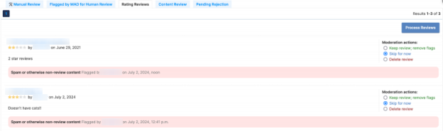

# Moderation Review Guide

## Overview 

Registered ATN users can post reviews for add-ons along with a rating. They can also flag any other user's review for moderation in case they think it's inappropriate.

Reviews flagged for moderation are not immediately removed from the public site. They are added to the review moderation queue.

<figure><figcaption></figcaption></figure>

This queue displays all reviews pending moderation, including their author, content and rating. The text in bold below indicates the reason the user chose to flag that review for.

The _Action_ radio buttons provide 3 moderation options for each review:

* **Keep review; remove flags:** The review is OK and should stay public. The moderation flags are removed.
* **Skip:** Don’t moderate that review now (default action). The moderation flags stay.
* **Delete review:** The review is not OK and should be deleted.

Once you've chosen a moderation option for one or more reviews on that page, click on the Process Reviews button for the moderation to apply.

## Review Guidelines

These are the guiding rules we use to moderate user reviews, and developer replies if applicable:

* Delete reviews containing profanity, slander or personal attacks.
* Delete spam reviews.
* Delete any support, feature request or bug reports if that's the only content in the review.
  * Keep reviews that describe functionality of the add-on without making explicit ask for new features or bug fixes.
  * Don’t try to verify any issues described in the rating.
* Delete reviews that only point to "better" add-ons or new compatible versions in external sites.
* Delete reviews that don't provide a useful review of the add-on:
  * Delete review if the content is just "Good", "Bad", "This sucks".
* Delete reviews that contain content unrelated to the add-on being reviewed.
* Flag add-on for review if the rating review suggests that the add-on could be malicious.
* Keep all other reviews
